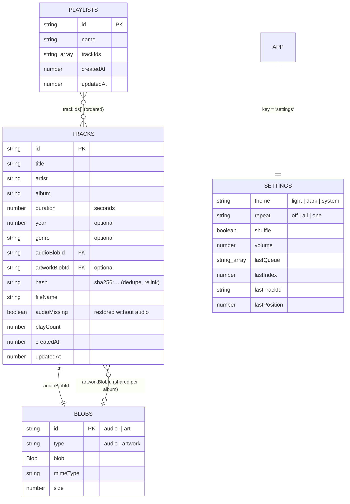

# Tunebox: an offline music player PWA

Import your own MP3s and play them in the browser, even offline. Tunebox reads ID3 tags and album art, keeps everything in IndexedDB on your device, and gives you playlists, a play queue, lock-screen controls and an installable app. There is no backend: a static Vercel deploy is the whole thing.

> Screenshots
>
> | Songs + queue (desktop, dark)          | Now Playing (mobile, light)                 | Playlist                          |
> | -------------------------------------- | ------------------------------------------- | --------------------------------- |
> | _screenshot: `docs/songs-desktop.png`_ | _screenshot: `docs/now-playing-mobile.png`_ | _screenshot: `docs/playlist.png`_ |

## Features

- **Import** (`/upload`): drag and drop files or a whole folder, or use the file and folder pickers. Files are hashed (SHA-256) for dedupe, then their tags are parsed with [`music-metadata`](https://github.com/Borewit/music-metadata), the maintained successor of `music-metadata-browser`. Embedded cover art is extracted. A per-file progress list shows the result: added, duplicate, relinked or failed (with a reason). When a file has no tags, the title and artist come from its file name (`01 - Artist - Title.mp3`).
- **Songs** (`/songs`): search, filter by artist or genre, and sort by date added, title, artist, album, duration or play count. These settings live in the URL, so they survive reloads and the Back button. You can multi-select (Shift-click selects a range), then Play, Play next, Add to queue, Add to playlist or Delete.
- **Playlists** (`/playlists`, `/playlists/:id`): create, rename and delete playlists. You can add songs from a picker or from any song list, remove them, and reorder them with drag and drop (mouse, touch long-press or keyboard). You can also search inside a playlist. Export a playlist from its **⋯** menu as M3U (`.m3u8`, readable by VLC, foobar2000 and most players) or Tunebox JSON, and import either on the Playlists page. Imported entries are matched to songs already in your library by content hash, then file name, then artist and title; the toast lists any that weren't found.
- **Now Playing** (`/now-playing`): large artwork on a backdrop tinted with the artwork's dominant colour, and a scrubbable timeline driven by `requestAnimationFrame`. It has play/pause, previous/next, shuffle, repeat (off, all, one), volume, a **Sound** button and an "Up next" preview.
- **Gapless playback and crossfade**: the next song is preloaded, so songs follow each other with no gap. Set **Crossfade** in the Sound panel (off, or 1–12 s) to overlap the end of each song with the start of the next.
- **Sound panel** (the sliders button in the player bar, or **Sound** on Now Playing): playback speed (0.5×–2×, pitch preserved), crossfade, volume normalization (every song at about −14 LUFS), and a 10-band equalizer with presets or custom bands. All settings are saved.
- **Queue**: a collapsible panel (side panel on desktop, bottom sheet on mobile) with drag-to-reorder, remove, clear and jump-to. It restores after a reload, including the last position.
- **Media Session**: title, artist, album and artwork on the lock screen and in OS media controls, plus play, pause, previous, next and seek actions.
- **PWA**: installable, with the app shell and all code chunks precached. Artwork thumbnails are served and cached by the service worker. The library, playlists and playback work fully offline.
- **Backup**: export metadata as JSON, or a full `.zip` with the audio. Restore merges into the current library and relinks songs by content hash.
- **Accessible**: full keyboard use, visible focus rings, labelled controls, live-region announcements, keyboard drag and drop, and `prefers-reduced-motion` support.
- **Themes**: light, dark or follow the system, applied before first paint.

## Quick start

```bash
cd vibe-coding-bootcamp/spotify-clone
npm install
npm run dev          # http://localhost:5173
```

In dev mode, the empty Songs page and the Import page show a **Load demo songs** button. It creates 8 tiny generated WAV tracks with canvas artwork and a "Demo mix" playlist, so you can try the UI without any MP3s.

| Script              | What it does                                                                   |
| ------------------- | ------------------------------------------------------------------------------ |
| `npm run dev`       | Vite dev server with HMR (service worker disabled)                             |
| `npm run build`     | Type-checks (`tsc -b`), builds to `dist/`, compiles `src/sw.ts` → `dist/sw.js` |
| `npm run preview`   | Serves `dist/` at http://localhost:4173, with the service worker active        |
| `npm run typecheck` | TypeScript only                                                                |
| `npm run lint`      | ESLint (flat config)                                                           |
| `npm run format`    | Prettier (with the Tailwind class sorter)                                      |
| `npm run icons`     | Regenerates `public/icons/*` (no image dependencies)                           |

To include the demo button in a production build (for a staging deploy): `VITE_ENABLE_DEMO=true npm run build`. Otherwise the seed module is removed from the bundle.

## Deploy to Vercel

The app is a static SPA, so no server or environment variables are needed.

1. Push the repo to GitHub.
2. In Vercel, go to **Add New… → Project** and import the repository.
3. Set **Root Directory** to `vibe-coding-bootcamp/spotify-clone`. This folder lives inside a larger repo.
4. The framework preset is detected as **Vite**. `vercel.json` already sets the build command (`npm run build`) and the output directory (`dist`).
5. Click **Deploy**.

`vercel.json` also:

- rewrites every path to `/index.html`, so deep links such as `/playlists/abc` work. Vercel serves real files first, so `sw.js`, icons and assets are unaffected.
- serves `sw.js` with `Cache-Control: no-cache`, so app updates are picked up promptly.
- serves hashed `/assets/*` as immutable, for long-term caching.

From the CLI instead: `npx vercel` inside this folder, then `npx vercel --prod`.

## PWA: install and test offline

The service worker only runs in a production build (`npm run build && npm run preview`, or the deployed site), and only over HTTPS or on `localhost`.

**Install**

- Chrome, Edge (desktop or Android): use the **Install app** button in the top bar, or the install icon in the address bar.
- Safari on iOS or iPadOS: **Share → Add to Home Screen**. Safari has no install prompt event.
- Safari on macOS (Sonoma or later): **File → Add to Dock**.

**Offline test**

1. Open the site once while online and wait for the toast _"Tunebox is ready to work offline."_
2. Import a few songs.
3. In DevTools, go to **Application → Service Workers** and check that `sw.js` is _activated and running_. Go to **Application → Cache Storage** to see the precache and `tunebox-artwork-thumbs-v1`.
4. Go to **Network**, select **Offline**, and reload. The library, playlists, artwork and playback all still work, and the top bar shows an **Offline** badge.
5. While offline, open a URL the app doesn't know as a file (for example `/nothing.txt`). You'll get the offline fallback page (`public/offline.html`).
6. Updates: after a new deploy, a toast offers **Reload** to switch to the new version.

## How it works

### Project layout

```
spotify-clone/
├── index.html                 # app shell, pre-paint theme script, manifest link
├── vercel.json                # SPA rewrites + caching headers
├── vite.config.ts             # React, vite-plugin-pwa (injectManifest), chunking
├── tailwind.config.ts         # colours mapped to CSS variables (light/dark)
├── eslint.config.js           # ESLint 10 flat config
├── .prettierrc
├── tsconfig*.json             # app / service worker / node projects
├── public/
│   ├── manifest.webmanifest
│   ├── offline.html           # fallback for unmatched offline navigations
│   └── icons/                 # generated by scripts/generate-icons.mjs
├── scripts/generate-icons.mjs
└── src/
    ├── main.tsx, App.tsx      # providers + router (lazy route chunks)
    ├── sw.ts                  # service worker (Workbox)
    ├── types.ts               # Track, Playlist, BlobDoc, AppSettings, Queue…
    ├── styles/tailwind.css    # theme tokens, components, focus, reduced motion
    ├── db/
    │   ├── indexedDb.ts       # Dexie schema, versions/migrations, settings, error messages
    │   └── library.ts         # write operations (tracks, playlists, storage)
    ├── lib/
    │   ├── id3.ts             # tag + artwork extraction, file-name fallback
    │   ├── audio.ts           # time formatting, object URLs, placeholder + dominant colour
    │   ├── importer.ts        # hash → dedupe → parse → store pipeline
    │   ├── queue.ts           # pure queue reducer (shuffle, repeat, reorder…)
    │   ├── backup.ts          # JSON / zip export and restore
    │   ├── playlistFiles.ts   # playlist M3U / JSON export, import and matching
    │   └── utils.ts
    ├── hooks/
    │   ├── usePlayer.ts       # playback engine + Media Session + persistence
    │   ├── useIndexedDb.ts    # live queries (library, playlists, settings, blob URLs)
    │   ├── useProgress.ts     # rAF playback position, local to the component
    │   ├── useTrackActions.tsx, useTheme.ts, useBrowser.ts
    ├── state/contexts.ts      # React contexts (library, player, toasts, UI)
    ├── components/            # PlayerBar, QueueDrawer, SongList, Artwork, UploadDropzone,
    │   │                      # TopBar, SearchBar, PlaylistCard, AppShell, dialogs…
    │   ├── providers/         # Library, Player (<audio>), Toast, UI providers
    │   └── ui/                # Dialog (<dialog>), Menu, SortableList (dnd-kit)
    ├── pages/                 # Upload, Songs, Playlists, PlaylistDetail, NowPlaying
    └── dev/                   # demo seed (dev flag only)
```

### Data model

IndexedDB database `tunebox`, accessed through [Dexie](https://dexie.org):



- `resumePoints` (added in v3) holds `{ trackId, position, updatedAt }` for long tracks. Deleting a track deletes its resume point. It isn't part of backups.
- Indexes: `tracks` on `title, artist, album, createdAt, hash, artworkBlobId, [fileName+duration], playCount`; `blobs` on `type`; `playlists` on `name, updatedAt`.
- **Migrations**: every schema change is a new `db.version(n)` block in `src/db/indexedDb.ts`, with an `.upgrade()` that fills in data. Version 2 added play counts and backfills `playCount = 0` for libraries created on v1. Version 3 added the `resumePoints` store. If another tab upgrades the schema, this tab closes its connection and reloads instead of blocking.
- Artwork blobs are **content-addressed**, so the tracks of one album share one image. Deleting a track deletes its artwork only when no other track still uses it.

### Playback and queue

```
 SongList / Playlist / Queue ──► usePlayer()  (context API)
                                     │
                     queueReducer (pure) ── items[{uid, trackId}], index, unshuffled[]
                                     │
               load effect: blob ─► object URL ─► <audio src>   (revoked when unused)
                                     │
      events: ended → next / repeat-one · error → toast + skip · timeupdate → play count, save position
                                     │
               Media Session metadata + handlers · settings persisted to IndexedDB
```

- **Two decks**: `PlayerProvider` renders two `<audio>` elements. One plays the current track; the other preloads the next track in the queue (none with repeat one). At the end of a track, or `crossfade` seconds before it, the preloaded deck starts and the two swap roles, so there is no load gap. Skipping to the preloaded track by hand also switches instantly.
- **Crossfade** (0–12 s, stored in settings): an equal-power fade (cos/sin curves) on `audio.volume`, updated every 40 ms, capped at a third of the track so short songs still mostly play. Pausing mid-fade stops both tracks; skipping ends the fade. Fades deliberately don't use the Web Audio API, which can stop background playback on iOS. iOS ignores `audio.volume`, so there the setting is disabled and songs play gaplessly without fading.
- **Speed** sets `playbackRate` and `defaultPlaybackRate` on both decks (a new source resets `playbackRate` to the default) with `preservesPitch`.
- The queue holds track IDs plus a per-slot `uid`, so the same song can be queued twice. It supports play-from-here, enqueue, **Play next**, remove, reorder, clear upcoming and jump.
- **Shuffle** keeps the current track and shuffles only what comes next, remembering the original order. Turning shuffle off restores that order.
- **Repeat** cycles off → all → one. With repeat one, a track loops when it ends naturally, but Next still skips.
- **Previous** restarts the track if you are more than 3 seconds in; otherwise it goes back one track.
- The timeline reads `audio.currentTime` on `requestAnimationFrame`, but only inside the timeline component, so the rest of the UI doesn't re-render every frame. Dragging previews the position and seeks on release. Arrow keys seek 5 s.
- A play counts after 30 s (or half of a short track). Play counts drive the "Most played" sort.
- **Resume**: songs of 10 minutes or more (mixes, audiobooks, podcasts) remember where you stopped, and pick up there the next time you play them, with a toast saying so. Press Previous to start over. The spot is saved every 5 s, on pause, when you switch songs and when the tab is hidden. It's forgotten once you're within 10 s of the start or 15 s of the end. Resume points live in their own `resumePoints` store, so saving them doesn't refresh the library views.

### Equalizer and normalization

```
 deck A <audio> ─► source ─► gain (normalization A) ─┐
                                                     ├─► preamp ─► 10 peaking bands ─► speakers
 deck B <audio> ─► source ─► gain (normalization B) ─┘
```

- The Web Audio graph (`src/lib/soundGraph.ts`) is built only the first time the equalizer or normalization is switched on. Once an `<audio>` element is routed through Web Audio it can't be un-routed, and on iOS that routing can stop playback when the screen locks, so with both effects off playback stays on the plain `<audio>` path. Turning them off later makes the graph neutral; a reload removes it.
- **Equalizer**: octave bands at 31 Hz–16 kHz, ±12 dB, Q 1.41. The preamp lowers the input by the largest boost so boosted bands don't clip. Presets live in `src/lib/eq.ts`; moving any band switches the preset to _Custom_.
- **Normalization** (`src/lib/loudness.ts`): each track is measured once, in the background, when it's current or next with normalization on. The audio is decoded at a reduced sample rate, K-weighted, and gated per ITU-R BS.1770 (400 ms blocks, −70 LUFS absolute and −10 LU relative gates). The result (`loudness: { lufs, peakDb }`) is stored on the track. Playback applies `−14 LUFS − lufs`, limited to −12…+8 dB and to 1 dB below the track's peak, on that deck's own gain node, so crossfades stay balanced. Tracks over 30 minutes aren't measured and play unchanged.
- Element `volume` and `muted` still apply before the source node, so the volume slider and crossfades work the same with effects on.

### Artwork

1. **Thumbnails**: small artwork is requested as `/artwork/<blobId>?s=96|192|384`. The service worker reads the image from IndexedDB, crops and resizes it with `OffscreenCanvas`, and caches it cache-first (400 entries max, LRU). IDs are content hashes, so cached entries never go stale.
2. **Full size**: large views and dev mode, where there's no service worker, use a shared, ref-counted object URL that is revoked 30 s after its last user unmounts.
3. **Placeholder**: when a song has no artwork, a deterministic gradient (hue from the file hash) is shown with the album's initials.

## Backup and restore

Backups live on the **Import** page, under _Backup & restore_.

- **Export metadata (.json)**: songs, playlists and settings, without audio. The file is small; keep it with your music folder.
- **Export with audio (.zip)**: the same JSON, plus `audio/` and `artwork/` folders. It shows the size first. The zip is built in memory, so very large libraries may fail on phones; if that happens, export metadata only.
- **Restore backup**: accepts either file and merges into the current library:
  - A song whose content hash already exists on this device links to it; nothing is duplicated.
  - A song from a zip gets its audio restored.
  - A song from a JSON-only backup with no local audio is kept and marked _audio missing_ (dimmed, with a warning icon). **Import the original file later and it relinks automatically**, and its playlists come back intact.
  - A playlist with the same ID and name is merged. A playlist with the same ID but a different name is kept alongside, so nothing is overwritten.

## Keyboard shortcuts

Press `?` (or click **Keyboard shortcuts** at the bottom of the sidebar) to see this list in the app. Shortcuts work anywhere except while typing in a field or while a dialog is open. Volume, seek, shuffle and repeat keys show a short indicator at the top of the screen, which screen readers also announce. Letter keys work with Caps Lock on.

| Key                                       | Action                                               |
| ----------------------------------------- | ---------------------------------------------------- |
| `Space` / `K`                             | Play / pause (when focus isn't on a button or field) |
| `Shift` + `→` / `N`                       | Next track                                           |
| `Shift` + `←` / `P`                       | Previous track (restarts the track after 3 s)        |
| `←` / `→`                                 | Seek back / forward 5 seconds                        |
| `J` / `L`                                 | Seek back / forward 10 seconds                       |
| `0` – `9`                                 | Jump to 0 % – 90 % of the track                      |
| `Shift` + `↑` / `↓`, `+` / `-`            | Volume up / down 10 %                                |
| `M`                                       | Mute / unmute                                        |
| `S` · `R`                                 | Shuffle on/off · cycle repeat (off → all → one)      |
| `<` / `>`                                 | Slower / faster (0.5× – 2×)                          |
| `Q`                                       | Show / hide the queue                                |
| `/`                                       | Focus the search box                                 |
| `?`                                       | Show the shortcuts list                              |
| `Space`, arrows, `Space` on a drag handle | Pick up, move, drop (`Esc` cancels)                  |
| `Esc`                                     | Close menus, dialogs and the mobile queue sheet      |

Arrow keys are left alone when the focused control uses them itself: the timeline and volume sliders, menus, and drag handles.

**Media keys**: the play/pause, next, previous and stop keys on keyboards and headsets, and the OS media controls, go through the Media Session API. They work even when Tunebox isn't the focused tab, as long as the OS sends them to Tunebox. The OS sends media keys to one "current" media player, and that can switch to another tab or app once Tunebox pauses (for example a paused video in another browser). When the Tunebox tab has focus, the page therefore also listens for media keys itself: if a key hasn't reached the Media Session within 400 ms, the page handles it, so nothing fires twice. In browsers without Media Session, the page always handles them while the tab has focus. If media keys go to another app while Tunebox is in the background, close that app's media or play Tunebox again.

## Acceptance test (manual script)

Run this against `npm run build && npm run preview`, or the deployed URL, in a fresh browser profile. Before a release, also run it on a phone.

1. **First run**: open `/`. You're redirected to `/songs`, which shows _"Your library is empty"_. Wait for the _"ready to work offline"_ toast.
2. **Upload**: on **Import**, choose 3–4 MP3s, including one exact duplicate and one file without tags. The progress bar fills; the list shows _Added_ for each new file and _Already in library_ for the duplicate. A toast summarises the import.
3. **Songs appear**: click **View songs**. Every imported song is listed with its title, artist, album and duration. The untagged file shows a title and artist taken from its file name.
4. **Artwork shows**: songs with embedded art show their thumbnail. The untagged song shows a gradient tile with initials.
5. **Add to queue**: click a song to play it, then open another song's **⋯** menu and choose **Add to queue**. A toast confirms it.
6. **Play**: time advances in the player bar. The OS media controls or lock screen show the title and artwork. Pause, Next and Previous work.
7. **Collapse and expand the queue**: click the queue button, or press `Q`. The panel opens with the queued song under _Next up_, and the button reports `aria-expanded="true"`. Click again and it closes.
8. **Create a playlist**: on **Playlists**, choose **New playlist**, type _Road Trip_ and click **Create**. You land on the empty playlist.
9. **Add songs**: click **Add songs**, tick all of them and click **Add**. The playlist lists them, with its total duration in the header.
10. **Reorder**: drag a song by its handle, or focus the handle and press `Space`, `↓`, `Space`. Reload the page; the new order is kept.
11. **Offline reload**: in DevTools, go to **Network → Offline** and reload. The playlist page loads; press **Play** and the audio plays; the top bar shows **Offline**. Opening `/now-playing` directly also works.

An automated run of these steps against the production build passed with Playwright in headless Edge (desktop 1360×860 and mobile 390×844), with no console errors.

## Known limitations

- **Storage quotas**: every browser caps how much a site can store, usually a share of free disk space; the exact limits vary by browser and version. The Import page shows your usage and quota, and has a **Make storage persistent** button. If storage fills up, the import stops with an explanation.
- **Safari and iOS**:
  - The equalizer and normalization route audio through Web Audio, which iOS may stop when the screen locks. They're off by default; if background playback stops, turn both off and reload.
  - Crossfade is unavailable (iOS ignores `audio.volume`), but playback is still gapless.
  - Safari may delete site data after 7 days without a visit, unless the app is installed to the Home Screen. Install it if you care about your library.
  - iOS ignores `audio.volume`; the hardware buttons control volume.
  - Background audio in an installed iOS PWA works, but it can stop if iOS suspends the app.
  - Media Session seek actions are only partly supported.
  - There's no install prompt event; use _Add to Home Screen_.
  - Safari can't encode WebP, so thumbnails fall back to PNG. That's handled automatically.
- **Formats**: MP3 works everywhere. M4A, OGG, FLAC and WAV import when the browser can decode them (for example, FLAC and OGG don't work in older Safari). Unplayable files are rejected with a message.
- **Plain HTTP on a LAN IP** (for example testing on a phone at `http://192.168.x.x`): there's no service worker and no WebCrypto there. The app still works, falling back to a non-cryptographic hash for dedupe, but offline mode and thumbnails need HTTPS or `localhost`.
- **Private browsing**: some browsers block or wipe IndexedDB in private windows. The app shows a clear error instead of failing silently.
- **Large full backups** are built in memory; see _Backup and restore_.
- **Tooling**: the spec asked for `.eslintrc.cjs`, but ESLint 10 only reads flat config, so the rules live in `eslint.config.js`. The React Compiler lint rules are off because this app doesn't use the compiler, and its player drives an imperative `<audio>` element.

## Troubleshooting

| Problem                                      | Fix                                                                                                                                                                   |
| -------------------------------------------- | --------------------------------------------------------------------------------------------------------------------------------------------------------------------- |
| No **Install** button                        | It appears only in production builds, over HTTPS or on `localhost`, in Chrome or Edge, after the service worker is active. In Safari, use Share → Add to Home Screen. |
| Offline reload shows the browser's dino page | The service worker wasn't active yet. Load once online and wait for the "ready to work offline" toast. It also doesn't run under `npm run dev`.                       |
| "Out of storage space" during import         | Delete songs you don't need, free disk space, or click _Make storage persistent_ on the Import page.                                                                  |
| A song shows ⚠ _audio not on this device_    | It came from a metadata-only backup. Import the original file; it relinks by content hash.                                                                            |
| "Couldn't play …, the file may be damaged"   | The browser couldn't decode it. Re-encode it as MP3, then delete and re-import it.                                                                                    |
| Stuck on an old version after a deploy       | Click **Reload** on the update toast, or close every Tunebox tab and open it again.                                                                                   |
| Deep links 404 on your own host              | Configure SPA fallback to `/index.html` (already done in `vercel.json` for Vercel).                                                                                   |
| Library won't open (error screen)            | Allow site data for the domain, leave private browsing, and reload.                                                                                                   |
